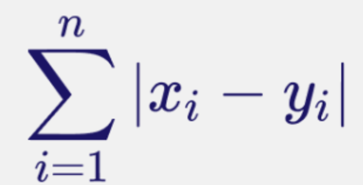

## 一、创建嵌入

### 1. 核心概念：什么是嵌入（Embedding）？

在该语境下，**嵌入**是指将高维数据（如包含数百个像素的图像）转换为低维、稠密的数值向量（如仅有 2 个数字的向量）。这个向量捕获了原始数据的核心特征（例如数字的形状、倾斜度等）。

### 2. 顶层：MNIST 数据集

- 图中展示了 **MNIST 手写数字数据集**，这是机器学习领域最经典的入门数据集，包含大量 `28×28` 像素的 `0−9` 手写数字黑白图片。

### 3. 中间层：自编码器架构（逻辑流）

这部分展示了数据处理的宏观流程：

- **输入 (Input** `x`): 原始图像（例如一个数字 "5" 的图像）。
- **编码器 (Encoder):** 一系列神经网络层，其作用是不断压缩信息，剔除噪音，只保留最核心的特征。
- **潜在空间 (Latent Space) / 嵌入 (Embedding):** 这是模型中最窄的部分（瓶颈层）。中间红色方框里的内容就是**嵌入**。它用极少量的数据表达了输入图像的本质。
- **解码器 (Decoder):** 编码器的镜像。它的任务是根据那一小串“嵌入”数据，尝试还原、重构出原始图像。
- **输出 (Output** `x′`**):** 模型重构出的图像。训练模型的目标就是让输出 `x′` 尽可能接近输入 `x`。

### 4. 底层：具体神经网络结构（技术细节）

这部分通过**全连接层（Dense layers）**具体展示了维度的变化：

- **输入层:** 接收图像像素数据。
- **编码过程:**第一层有 **256** 个神经元。第二层压缩到 **128** 个神经元（绿色）。
- **嵌入层（中心红色部分）:** 最终被压缩到只有 **2** 个神经元。这意味着这张复杂的数字图片被转化为了一个二维坐标点 `(x,y)(x,y)`。这 2 个数字就是该图片的“嵌入”。
- **解码过程:**从 2 个神经元扩展回 **128** 个（蓝色）。再扩展到 **256** 个。
- **输出层:** 恢复到原始像素维度。

### 总结：这页课件想告诉我们什么？

1. **降维:** 嵌入的过程实际上是极度降维的过程（从成百上千的像素降到 2 个数值）。
2. **特征提取:** 为了能让解码器还原出数字 "5"，中间那 2 个数值（嵌入）必须包含关于“这个数字是 5”以及“它是怎么写的”最关键的信息。
3. **应用场景:** 这种“嵌入”向量非常有价值。例如，在 **Weaviate** 这样的向量数据库中，我们可以通过比较这些简短的数值向量，快速找到视觉上相似的数字，而不需要对比每一个像素。

## 二、向量嵌入的本质

### 1. 核心定义

- **Vector embeddings capture meaning（向量嵌入捕获意义）：**
  这是最关键的一点。嵌入不仅仅是数字，它们代表了数据的“语义”或“特征”。在数学空间里，意义相近的数据（比如两张不同的“0”的图片，或者两段意思相近的话），它们的向量距离会非常接近。
- **Machine understandable format of the data（机器可理解的数据格式）：**
  人类通过视觉（看图）或语言（读文字）来理解信息，但计算机只能处理数字和数学运算。嵌入就是将“人类的理解”翻译成“机器的语言”。

### 2. 案例对比：从人类理解到机器理解

课件通过两个具体的例子展示了这种转化：

#### **例子 A：图像（手写数字 "0"）**

- **Human Understandable（人类理解）：** 我们看到的是一个白色的圆圈，立刻认出它是数字“0”。
- **Machine Understandable（机器理解）：** 机器看到的是一个包含两个数值的向量 [-0.0493, -0.1496]。*注意：* 这对应了你上一张图中那个只有 **2个神经元** 的红色瓶颈层。对于简单的手写数字，两个维度可能就足以区分不同数字的特征了。

#### **例子 B：文本（莎士比亚的名言）**

- **Human Understandable（人类理解）：** “If you can look into the seeds of time...” 这一段充满诗意和深意的文字。人类从中读出了时间、预知和命运。
- **Machine Understandable（机器理解）：** 机器将其转化为一长串数字（高维向量），如 [-0.2479, -0.1360, -0.1075, ...]。*注意：* 文本通常比简单的图片更复杂，因此它的向量长度（维度）通常要长得多（例如几百甚至上千维），以便捕获细微的语义差别。

### 3. 这页课件传达的核心观点：

1. **翻译官角色：** 嵌入模型就像一个翻译官，把非结构化的数据（图片、文字、音频）变成结构化的数字列表。
2. **数学运算代替逻辑推理：** 一旦数据变成了向量，机器就可以通过计算“向量之间的距离”（如余弦相似度）来判断两段文字是否相关，或者两张图片是否相似，而不需要真的“读懂”诗歌或“看见”图片。
3. **从感性到理性：** 人类对“0”的认知是感性的，而机器对 [-0.0493, -0.1496] 的处理是理性的数学计算。

## 三、曼哈顿距离

计算向量之间距离的一种常用方法：**曼哈顿距离（Manhattan Distance）**，在数学和机器学习中通常被称为 **L1 范数**或 **L1 距离**。

### 1. 直观定义

- **课件文字：** "Distance between two points if one was constrained to move only along one axis at a time."
- **解释：** 想象你在像纽约曼哈顿那样网格状的街道上开车。你不能横穿建筑（走对角线直线），你只能沿着街道横向或纵向行驶。
- **图中展示：** 两个深蓝色点之间的绿色箭头路径，就是曼哈顿距离。它由水平位移和垂直位移的总和组成。

### 2. 数学公式解读

课件右侧给出了计算公式：

- `x` 和 `y`：代表两个向量（即上一页提到的“嵌入”）。
- `i`：代表维度的索引。如果向量有 2 维，则 `i` 从 1 到 2；如果有 100 维，则从 1 到 100。
- `∣xi−yi∣`：这是计算两个向量在**每一个维度**上的差的**绝对值**。
- `∑` (求和符号)：将所有维度上的绝对差值全部加起来。

**举个例子：**
假设有两个嵌入向量：点 A (1,2)，点 B (4,6)。曼哈顿距离 =∣1−4∣+∣2−6∣=3+4=7=∣1−4∣+∣2−6∣=3+4=7

### 3. 为什么在“嵌入”课件中讲这个？

在向量搜索（Vector Search）或推荐系统中：

1. **比较相似性：** 机器通过模型把图片变成向量后，需要一种方法来判断“图片A”和“图片B”是否接近。
2. **距离越小，相似度越高：** 如果两个向量之间的曼哈顿距离很小，机器就认为这两份数据在语义上是非常相似的。
3. **计算效率：** 曼哈顿距离只涉及减法和加法，不涉及平方或开方运算（不像欧几里得距离），因此在某些高维计算场景下非常高效。

## 四、KNN 的性能分析

### 1. 核心公式：`O(dN)` 运行时间复杂度

课件顶部给出了一个数学表达式：O(dN)。这是衡量算法运行速度（时间复杂度）的专业术语：

- `N` **(Number of Data Points)：** 数据库中向量的总数（数据规模）。
- `d` **(Dimensionality)：** 每个向量的维度（即每个“数字指纹”包含多少个数字）。
- **含义：** 搜索一个结果所需的时间与**数据总量**成正比，也与**向量的长度**成正比。

### 2. 图表解读：线性增长的代价

观察图表：

- **横轴 (X-axis)：** 数据点的数量（从 0 到 50,000）。
- **纵轴 (Y-axis)：** 单次查询所需的时间。
- **趋势：** 图像是一条**斜向上的直线**。这代表了“线性增长”。当你有 10,000 个点时，查询时间很短（约 0.5 单位）。当点数增加到 50,000 个时，查询时间增加到了 2.5 单位。**结论：** 随着你的数据量翻倍，你的搜索耗时也会跟着翻倍。

### 3. 为什么这是一个“痛点”？

这页课件实际上揭示了暴力搜索在处理**大数据**时的致命弱点：

1. **不可扩展性：** 如果你的数据库有 1 亿个数据点（这在现代 AI 应用中很常见），单次搜索可能需要几秒甚至几分钟，这在实时搜索（如 ChatGPT 或电商搜索）中是完全无法接受的。
2. **维度灾难：** 现代大模型的嵌入向量维度通常很高（如 768 维或 1536 维），较大的 `d` 值会让计算量进一步激增。
3. **算力昂贵：** 每次搜索都要遍历全库，会消耗巨大的 CPU/GPU 资源。

## 五、小世界

它是现代高性能向量数据库（如 Weaviate）的核心算法——**HNSW（分层导航小世界图）**的灵魂。

### 1. 核心概念：小世界现象

- **课件文字：** "Observed phenomenon in human social networks where everyone is closely connected."
- **解释：** 这是一个在人类社交网络中发现的现象：虽然世界很大，人口很多，但通过亲友关系，人与人之间的距离比我们想象的要近得多。

### 2. 六度分隔理论（Six Degrees of Separation）

- **课件文字：** "Popularized concept that any two individuals are on average separated by six acquaintance links."
- **解释：** 你和世界上任何一个陌生人（比如埃隆·马斯克）之间，平均只需要通过 6 个中间人就能建立联系。
- **图中表现：** 你可以看到从点 **A** 到点 **B**，虽然中间隔着密密麻麻的节点，但实际上只经过了 6 个跨度较大的连接（1-2-3-4-5-6）就到达了目的地。

### 3. 高聚类性（High Clustering）

- **课件文字：** "Nodes form tightly-knit groups, with members of groups connecting to one another."
- **解释：** 节点倾向于形成“朋友圈”。你的朋友大概率也是彼此的朋友。在数学空间里，这意味着“相似”或者“接近”的点会聚成一簇一簇。

### 4. 短路径长度（Short Path Lengths）

- **课件文字：** "Despite high clustering, only a few steps are needed to connect any two nodes."
- **解释：** 尽管大家都在各自的小圈子里，但只要有几个“跨圈子”的长途连接（就像图中那些横跨大半空间的线），你就可以在极短的步数内从网络的一端跳到另一端。

### 5. 为什么要在这里讲“小世界”？（最重要的一点）

这页课件是为了引出**如何优化向量搜索**。它给出了一个天才的思路：

- **暴力搜索的问题：** 相当于你在不认识路的情况下，敲开全世界所有人的家门去问“你是不是我要找的人？”。
- **小世界搜索的方案：** 如果我们将数据库里的向量也组织成一个像“社交网络”一样的图：每个向量只和自己“近郊”的几个邻居连接。同时保留一些指向“远方”的长连接。**搜索时：** 机器可以先通过长连接实现“大跨步”跳转，快速接近目标区域，然后再在那个区域的小圈子里精细搜索。

### 总结：

这页课件是在告诉我们：**我们不需要遍历所有数据点。** 如果数据像“小世界”一样组织，我们可以通过“跳跃式搜索”在极短的时间内（对数级复杂度，而不是线性复杂度）找到最相似的结果。

## 六、NSW 算法

### 第一张图：NSW（Navigable Small World，可导航小世界）

这张图展示了一个**理想情况**，即算法成功找到了真正的最近邻。

- **Entry Node (入口节点 - 节点 7):** 搜索并不是从空白开始的，而是从图中的某一个预设点（入口）开始。
- **Query Vector (查询向量 - Q):** 用户想要搜索的目标。
- **导航过程:** 算法从节点 7 开始，观察它的邻居。它会计算：在邻居中，谁离目标 `Q` 最近？然后“跳”到那个点。
- **最终结果:** 在这个例子中，算法通过图中的连接路径，最终定位到了**节点 6**。
- **Nearest Neighbor Vector:** 节点 6 是空间上离 `Q` 最近的点，搜索成功。

### 第二张图：NSW -（近似最近邻的局限性）

这张图展示了算法的一个**核心特性**（也是潜在的缺点）：**近似性**。

- **新的 Entry Node (入口节点 - 节点 0):** 这次搜索从底部的节点 0 开始。
- **路径选择:** 算法沿着图中的蓝色实线移动。从节点 0 开始，它可能会跳到节点 1。
- **最终结果:** 算法停在了**节点 1**。
- **Approximate Nearest Neighbor (近似最近邻):** 注意看，虽然节点 6 仍然是物理距离上最接近 `Q` 的（Nearest Neighbor），但因为入口点和图连接路径的限制，算法最终找到了**节点 1**。
- **核心启示:** 节点 1 虽不是“绝对最好”的，但它是“足够好”的。这就是为什么它被称为“**近似**最近邻（ANN）”。

### 总结：

1. **跳跃式搜索:** 相比暴力搜索对比 8 个点，NSW 可能只需要对比 3-4 个点（沿着线跳跃），这在数据量巨大时能极大地提高效率。
2. **入口点很重要:** 从不同的地方进入图，可能会得到不同的搜索结果。
3. **速度与准确性的权衡 (Trade-off):**暴力搜索: 慢，但永远能找到节点 6。**NSW 搜索:** 快，但有时会给你节点 1（近似结果）。在现实的大规模 AI 应用中，这种“极速换取微小精度损失”的做法是非常值得的。

**进阶背景：**
这两张图实际上是在为更高级的 **HNSW (Hierarchical NSW)** 算法做铺垫。HNSW 通过建立“多层”的图（就像地图有全国地图和城市地图之分），解决了这种容易掉进“局部最优解”（只找到节点 1 而找不到节点 6）的问题，从而在保持超快速度的同时，极大地提高了找到真正最近邻的概率。这也是 **Weaviate** 等向量数据库能够高效运行的核心秘密。

## 七、HNSW 算法

### 1. 核心思想：给向量分层

HNSW (Hierarchical Navigable Small World，分层导航小世界)  的精髓在于“分层”。它模仿了数据结构中的“跳表（Skip List）”，将原本平面的图结构变成了多层的金字塔结构。

### 2. 流程图上半部分：随机分配“最高层”

- **Vec 1, Vec 2... Vec N（原始向量）：** 数据库中所有的向量。
- **Random Generator（随机生成器）：** 这是一个非常关键的设计。对于每一个进入数据库的向量，算法都会通过一个概率公式（通常是指数衰减概率）为它随机分配一个 **“最高层级（Max Layer）”**。
- **分配结果：**绝大多数**向量会被分配到最低层（Layer 0）。**只有少数向量能晋升到更高的层级。层级越高，节点越稀疏（就像金字塔的顶端，人最少）。

### 3. 流程图下半部分：节点的垂直分布规律

这里展示了节点是如何在不同层级中存在的。一个重要的原则是：**如果一个节点的最高层是** M**，那么它必须出现在从 `0` 到 `M` 的每一层中。**

- **Max Layer = 0:** 该节点只存在于第 0 层。
- **Max Layer = 1:** 该节点同时存在于第 0 层和第 1 层。
- **Max Layer = 2:** 该节点同时存在于第 0、1、2 层。
- **以此类推（Max Layer = M）：** 节点存在于该层及其下方的所有层。

### 4. 为什么要这样构建？

这种分层构建方式直接服务于后续的搜索：

- **最底层 (Layer 0)：** 包含数据库里**所有**的向量。这一层连接最紧密，用于最后的精细搜索。
- **上层 (Higher Layers)：** 只包含极少数向量。这些层级就像是“高速公路”或“特快列车”，它们连接的跨度很大。
- **搜索逻辑：**搜索从顶层开始，在大跨度的节点间跳转，快速定位到目标大概所在的区域。然后进入下一层，继续缩小范围。最后降到第 0 层，找到最精确的邻居。

### 总结：

HNSW 不再是一张大网，而是由**多张疏密程度不同、相互叠放的网**组成的。

- **随机性**保证了层级分布的科学性。
- **垂直重叠**保证了每一层之间是连通的。

## 八、HNSW 的性能分析

### 1. 核心理论支撑

- **高层级节点的低概率分布（Low likelihood in Higher Levels）：**正如上一页提到的，HNSW 采用类似“跳表”的结构。**解释：** 越往图的高层走，节点越稀疏。这种稀疏性是按指数级下降的。这意味着顶层只有极少数“精英节点”，它们充当了跨越整个向量空间的“高速路入口”。
- **查询时间呈对数增长（Query time increases Logarithmically）：**解释： 这是 HNSW 最神奇的地方。随着数据库中数据点（`N`）的增加，搜索所需的对比次数并不是成倍增加，而是以极慢的**对数（Logarithm）**速度增长。
- `O(log(N))` **运行复杂度：**
  - **解释：** 这是该算法的数学定论。在计算机科学中，`log(N)` 复杂度意味着算法具有极强的**可扩展性（Scalability）**。

### 2. 图表解读：与“暴力搜索”的鲜明对比

观察图表中的曲线：

- **横轴 (X-axis)：** 数据点数量（最高达到 `106106`，即 100 万个点）。
- **纵轴 (Y-axis)：** 单次查询所需的时间。
- **曲线形状：** 你可以看到，曲线在初期稍微上升后，很快就变得**非常平缓**。**含义：** 当你有 20 万个数据点和 100 万个数据点时，两者的搜索耗时差别其实并不大。

**对比之前的“暴力搜索”：**

- 还记得之前那一页 `O(dN)` 的图吗？那是一条**笔直向上**的斜线，数据越多，耗时越长，没有上限。
- 而 HNSW 的曲线接近于水平。这意味着 HNSW 能够轻松处理千万级甚至亿级的数据。

### 总结：为什么 HNSW 改变了游戏规则？

这页课件传达了三个关键结论：

1. **极速：** 通过多层导航，它避开了绝大多数不相关的计算，直接“空降”到目标区域。
2. **海量处理能力：** 因为复杂度是 `O(logN)`，它让处理百万、千万量级的数据在毫秒级完成成为可能。
3. **近似的代价：** 虽然它是“近似最近邻搜索”（ANN），可能会损失极其微小的精度，但它换取了成千上万倍的速度提升。

## 九、稠密搜索

### 1. 核心定义：稠密搜索 (Dense Search)

稠密搜索也就是我们通常所说的**语义搜索（Semantic Search）**。

- **技术基础：** 它利用了前面课程中讲到的所有技术——**向量嵌入（Vector Embeddings）**。数据（如文字、图片）被转化成了一串稠密的数字列表。
- **搜索方式：** 它通过计算这些向量在空间中的距离（如 HNSW 算法）来寻找结果，而不是简单地匹配字面上的单词。

### 2. 稠密搜索的核心价值

- **捕获语义（Capture Meaning）：** 课件指出，这种搜索方式允许系统捕捉并返回在**“语义上”相似**的对象。
- **跨越文字障碍：** 它能理解文字背后的含义，即使两个词看起来完全不同，只要意思相近，机器就能找出来。

### 3. 经典案例解读

课件下方给出了一个非常直观的例子：

- **用户输入（云朵图标）：** “Baby dogs”（狗宝宝）
- **机器返回（机器人图标）：** “Here is content on **puppies**!”（这里有关于小狗的内容！）

**深度解析这个例子：**

1. **关键词匹配（稀疏搜索）的局限：** 如果使用传统的关键字搜索，“Baby dogs”这两个词里完全没有“puppy”这个单词。因此，传统的搜索引擎可能找不到“puppy”相关的文章，或者排在很后面。
2. **稠密搜索（语义搜索）的胜利：**在嵌入模型看来，“Baby dogs” 和 “puppies” 的向量在空间中是极其接近的。模型知道在人类语言中，这两者代表同一个概念。因此，即使单词完全没重合，机器也能给出最准确的答案。

## 十、稠密搜索的挑战

### 第一页：领域外数据（Out of Domain Data）

稠密搜索极其依赖它背后的神经网络模型（即用来生成向量的模型）。

- **核心痛点：** 神经网络的效果取决于它所接触过的训练数据。
- **案例解析：**输入： “Fixing a car engine”（修汽车发动机）。**反应：** 图中是一个医生形象，他说“我不是汽车医生”。**含义：** 如果你的向量模型是在医疗文献上训练的，它对“医生”、“手术”、“诊断”这类词的理解很深，但如果你搜索“汽车零件”或“维修”，它可能完全理解错误，因为它在“知识盲区”里。
- **结论：** 稠密搜索在处理**专业术语、冷门领域**或**训练数据未覆盖的内容**时，准确率会大幅下降。

### 第二页：序列号与精确匹配（Serial Numbers & Word Matching）

这页揭示了稠密搜索在处理“非语义”数据时的短板。

- **挑战 A：产品序列号（Serial Number）**序列号、代码、零部件编号通常是随机或无意义的字母数字组合。**案例：** 输入 BB43300。**稠密搜索的错误：** 机器人回答“是大黄蜂（Bumble Bee）吗？”。**原理：** 语义模型总是试图在数据中找“意义”。它看到 BB 可能觉得像 Bumble Bee 的缩写。对于这种**需要百分之百精确匹配**的情况，模糊的向量计算反而会弄巧成拙。
- **挑战 B：字符串或单词匹配（String or Word Matching）**课件指出：在处理序列号这类需求时，使用**精确的字符串搜索**效果要好得多。**结论：** 稠密搜索擅长“模糊意图”，但不擅长“死板查询”。
- **引出新概念：稀疏搜索（Sparse Search / Keyword Search）**为了弥补稠密搜索的这些短板，我们需要回归到传统的**关键字搜索**，在技术上这被称为**稀疏搜索（Sparse Search）**。

### 总结：这两页课件想传达的核心观点

1. **稠密搜索不是万能的：** 它理解不了它没见过的领域，也处理不好没有实际语义的代码（如序列号）。
2. **传统搜索依然重要：** 传统的关键字搜索（稀疏搜索）在处理“精确匹配”和“专业代码”时具有不可替代的优势。
3. **铺垫：** 这两页实际上是在为接下来的 **“混合搜索（Hybrid Search）”** 做铺垫——即在 Weaviate 等数据库中，通常会将“稠密搜索”和“稀疏搜索”结合起来，取长补短。

## 十一、稀疏搜索

### 1. 什么是词袋模型（Bag of Words）？

- **核心逻辑：** 它是进行关键词匹配最简单的方法。它不关心单词的顺序、语法或含义，只是简单地**统计单词出现的次数**。
- **搜索方式：** 机器会计算查询语句（Query）中的单词在数据库文档中出现了多少次。匹配到的单词频率越高，该文档的排名就越靠前。

### 2. 为什么被称为“稀疏搜索（Sparse Search）”？

这里的“稀疏”是一个数学和计算机术语，用来描述向量的特征：

- **全量词汇表：** 假设你的系统词汇表包含了英语中所有的单词（比如几万甚至几十万个词）。
- **向量表示：** 当你把一句话转换成向量时，这个向量的长度等于词汇表的大小。
- **多为零（Mostly Zeroes）：** 因为一句话里只包含几个单词，所以在对应的向量中，只有这几个单词的位置上有数字（代表次数），而**绝大多数其他位置都是 0**。
- **结论：** 这种满是 0 的长向量被称为**稀疏嵌入（Sparse Embedding）**。

### 3. 示例图解：向量是如何生成的

图中展示了将一句话转换为“词袋向量”的过程：

- **原始文本：** "it is a puppy and it is extremely cute"（它是一只小狗，它非常可爱）。
- **向量化过程：**单词 **"it"** 出现了 2 次，所以对应位置填入 **2**。单词 **"extremely"**、**"cute"**、**"and"**、**"puppy"** 各出现了 1 次，填入 **1**。而词汇表中的其他词，如 **"aardvark"**（土豚）、**"cat"**（猫）、**"they"**（他们），在这句话里没出现，所以填入 **0**。

### 4. 稀疏搜索 vs. 稠密搜索

| 特性         | 稠密搜索 (Dense/Semantic)             | 稀疏搜索 (Sparse/Keyword)                    |
| ------------ | ------------------------------------- | -------------------------------------------- |
| **表示方式** | 长度固定、数值连续的向量（如 768 维） | 长度极大（词汇表大小）、满是 0 的向量        |
| **关注点**   | 捕捉**意思**（语义）                  | 捕捉**字面单词**（关键词）                   |
| **优点**     | 能理解“小狗”和“狗宝宝”是一个意思      | 极其精确，适合查零件号、特定名词             |
| **缺点**     | 容易在特定领域或随机代码上出错        | 无法理解同义词（搜“狗宝宝”可能搜不到“小狗”） |

## 十二、BM25

### 1. 核心定义：什么是 BM25？

- **Best Matching 25 (BM25):** 课件指出，在实际进行关键字搜索时，我们不会只用简单的词频统计，而是使用一种经过修正的算法。
- **地位：** BM25 是搜索引擎（如 Elasticsearch, Weaviate, Lucene）中计算关键词相关性的核心算法。它是著名的 **TF-IDF** 算法的升级版。

### 2. 数学公式背后逻辑（通俗版）

虽然公式看起来很复杂，但它主要解决了传统搜索的三个核心问题：

1. **单词的“稀有度” (IDF - 逆文档频率):**公式中的 IDF(qi) 部分。**逻辑：** 并不是所有词都一样重要。如果搜“的”，这个词在所有文章里都有，那它对区分结果没帮助。如果搜“引力波”，这个词很罕见，那包含它的文章就非常重要。BM25 会给罕见词更高的权重。
2. **词频饱和度 (Term Frequency Saturation):**公式中间的 f(qi, D) 部分。**逻辑：** 在一篇文章里，提到某个词 1 次和 0 次有巨大区别；但提到 100 次和 1000 次的区别其实没那么大。BM25 设定了一个上限，防止某个词出现次数过多导致评分无限增长。
3. **文档长度归一化 (Document Length Normalization):**公式右下角的 |D| / avgdl。**逻辑：** 长文章天然包含更多的单词。如果只看词频，长文章总是占便宜。BM25 会考虑文章长度：如果一篇短文提到了 3 次关键词，它的含金量通常比一篇长文提到 3 次要高。

### 3. 图解案例

课件下方通过一段莎士比亚的名言展示了效果：

- **左侧：** 原始文本。
- **右侧：** 转化后的向量。
- **特点：** 与上一页全是整数（1, 2, 0...）的词袋向量不同，这里的数值是**小数**（如 0.3305..., 0.2096...）。
- **含义：** 这些数字是根据 BM25 公式计算出的“重要性得分”。你可以看到向量中依然有很多 0（所以它还是**稀疏向量**），但非零的部分现在带有精确的权重，代表了每个词对这段话的代表性强弱。

### 总结：

这页课件想告诉我们：**真正的关键字搜索是很聪明的。**

- **它不是简单的数数：** 它会通过一套复杂的数学机制（BM25），自动识别出哪些词是废话，哪些词是重点，并根据文章长短给出公正的评分。
- **在 Weaviate 中的作用：** 当你在 Weaviate 中使用关键字搜索（Keyword Search）时，后台跑的就是这个 BM25 算法。

## 十三、混合搜索

### 1. 核心定义：什么是混合搜索？

- **Best of Both Worlds（两全其美）：** 混合搜索是指在同一个查询中，**同时执行**向量搜索（稠密/语义）和关键字搜索（稀疏/BM25），然后将两者的结果**合并**在一起。
- **核心逻辑：** 它既能听懂你“想找狗宝宝”的意图（语义），又能精准定位到你输入的“BB43300”零件序列号（关键词）。

### 2. 基于评分系统的融合机制

图表清晰地展示了后台是如何计算排名（Ranking）的：

- **双重打分：** 对于数据库中的某一个对象（比如 ID 为 1965 的文档）：**Vector search（向量搜索）：** 给了它 **0.8** 分（代表语义非常接近）。**BM25 search（关键字搜索）：** 给了它 **0.7** 分（代表关键词匹配度也很高）。
- **分数融合：** 系统将这两个分数相加（或按比例加权计算），得到最终总分 **1.5**。
- **最终排名（右侧表格）：**系统会根据计算出的**总得分（SCORE）**对所有搜索结果进行重新排序。在表格中，我们可以看到 ID 为 1965 的对象以 1.5 的总分排在**第 3 名**（RANK 3）。排在第一名的（ID 8743）分数为 1.9，说明它在语义和关键词两个维度上表现得最完美。

### 3. 为什么混合搜索是“行业标准”？

它解决了之前课件中提到的所有痛点：

1. **解决“领域外数据”问题：** 如果模型不理解某个专业术语，BM25 关键词匹配可以作为“安全网”确保能搜到。
2. **解决“序列号”问题：** 稠密搜索会搞混代码，但 BM25 会确保代码精准命中。
3. **解决“同义词”问题：** 关键词搜不到“puppy”，但向量搜索能把它找回来。

### 总结：整个系列课程的逻辑闭环

- **第一步：** 用深度学习把数据变成**向量（嵌入）**。
- **第二步：** 学习用 **HNSW** 算法在海量向量里进行**飞速搜索**。
- **第三步：** 发现纯向量搜索（稠密）的局限，引入 **BM25（稀疏）** 关键词搜索。
- **第四步：** 终极形态——**混合搜索（Hybrid Search）**。

## 十四、跨语言搜索

### 1. 核心理论：向量即“意义”

- **课件文字：** "Because embedding produces vectors that convey **meaning**, vectors for the same phrase in different languages produces similar results."
- **核心逻辑：** 之前我们学过，嵌入（Embedding）是将文字转化为代表其“语义（意义）”的数字指纹。
- **跨语言原理：** 尽管英语、中文、法语等语言的词汇和语法完全不同，但它们背后的**概念和逻辑**（即“意义”）是共通的。一个训练良好的“多语言嵌入模型”能够识别出不同语言中表达相同意思的短语，并将它们映射到向量空间中**几乎相同的位置**。

### 2. 案例分析：中英文对照

课件通过一个直观的例子展示了这一点：

- **英文短语：** "Vacation spots in California"（加利福尼亚州的度假胜地）
- **中文短语：** "加利福尼亚州的度假胜地"
- **向量结果：** 你会发现右侧生成的那一长串数字（向量）是**完全一样**的（从 -0.2479 到 0.1390）。

**这意味着什么？**
在计算机看来，它并不理解什么是“英文”或“中文”，它只看到了两组相同的坐标。由于坐标相同，计算机就判定这两个短语代表**完全相同的事物**。

### 3. 现实生活中的应用场景

这种特性在像 **Weaviate** 这样的向量数据库中具有极大的实战价值：

1. **跨语言检索：** 你可以用中文输入查询，系统能帮你从几百万篇纯英文的文档里精准找到匹配的内容。
2. **统一知识库：** 一家跨国公司可以将全球各分支机构不同语言的文档存在同一个数据库里，员工用母语搜索就能获取全球的信息，无需手动翻译。
3. **打破语言壁垒：** 搜索引擎不再受限于关键词的拼写，而是实现了跨越文化和国界的“概念匹配”。

### 总结：

这页课件想告诉我们：**向量嵌入是机器理解世界的“世界语”。**它证明了当数据被转化为“稠密向量”后，语言就不再是信息的孤岛。只要意思一致，无论用哪种语言表达，在向量空间里它们都是**同一个点**。这就是为什么现代 AI 能够如此顺畅地进行跨语言对话和搜索的技术基础。

## 十五、RAG

### 1. 核心定义：什么是 RAG？

**检索增强生成**简单来说就是：**给 AI 一个外部“知识库”或“大脑外挂”**。

- **检索（Retrieval）：** 先从海量私有或最新的数据中找到相关的材料。
- **增强（Augmented）：** 把找到的材料塞给大模型。
- **生成（Generation）：** 让模型参考这些真实材料来回答问题。

### 2. 课件要点拆解

- **使用向量数据库作为外部知识库：**大模型（如 GPT-4）虽然聪明，但它的知识停留在训练的那一刻。向量数据库充当了**“外部记忆”**，存储了模型在训练中没见过的、或者公司内部的真实事实信息。
- **检索相关信息并提供给 LLM：**当用户提问时，系统先去向量数据库里检索出最相关的原文段落。**流程：** 用户问题 `→→` 检索相关片段 `→→` 将片段与问题一起发给大模型（Prompt 提示词工程）。
- **与向量数据库的协同效应：**因为向量数据库支持**“语义搜索”**（之前学过的稠密搜索），所以它能理解用户的自然语言意图，精准找到对应的“知识点”。
- **为什么 RAG 更好（实用性）：**比起昂贵、缓慢且复杂的“模型微调（Fine-tuning）”，RAG 更加**务实且高效**。**实时更新：** 你只需要往数据库里增减文档，AI 的知识就会瞬间更新，而不需要重新训练模型。
- **生动案例：去图书馆查资料：**普通 LLM： 像一个聪明人凭记忆答题，但记性可能出错，会胡编乱造（幻觉）。**RAG：** 像一个聪明人在写论文前，先去**图书馆**查阅了所有相关的书籍和文献。他看着书本写出的答案，自然更准确、更专业，且有据可查。

### 总结：为什么这页课件非常重要？

这页课件揭示了向量数据库在当今 AI 时代的**真正商业价值**：

1. **解决“幻觉”问题：** 强制 AI 根据数据库里的真实文档回答，减少胡言乱语。
2. **解决“时效性”问题：** 让 AI 能够回答“今天早上的新闻”或“公司昨晚更新的财报”。
3. **数据安全与私有化：** 公司可以将敏感的私有文档存在 Weaviate 中，让通用的 AI 模型在受控的情况下使用这些信息。

## 十六、RAG 的优势

### 1. 减少“幻觉”（Reduce hallucinations）

- **什么是“幻觉”？** 在 AI 领域，“幻觉”指大语言模型一本正经地胡说八道，编造并不存在的事实。
- **RAG 如何解决它？**由于 RAG 强制要求大模型在回答前先阅读向量数据库提供的**真实原文（Source text）**，它的回答会被锁定在事实范围内，从而大大降低编造的可能性。**可验证性：** 用户可以通过将 AI 生成的内容与检索出来的“原文”进行对比，轻松识别 AI 是否在胡扯。这为 AI 的回答增加了一层**确定性**。

### 2. 能够“引用来源”（Enable a LLM to cite sources）

- **核心痛点：** 当你问 ChatGPT 一个问题时，它给出的答案往往没有出处，你很难信任它。
- **RAG 的优势：**在 RAG 流程中，我们知道每一段辅助信息是从数据库的哪一个文件、哪一页、哪一行检索出来的。因此，模型在生成答案时可以带上**脚注或引用链接**（例如：“根据公司 2023 年财报第 5 页所述...”）。这让 AI 的回答变得像学术论文一样严谨、可追溯，极大提升了**透明度和信任感**。

### 3. 解决“知识密集型”任务（Solve knowledge intensive tasks）

- **核心痛点：** 法律条文、医学手册、公司内部极其复杂的技术文档等，都是极其耗费记忆力的“知识密集型”内容。大模型不可能把所有这些细节都背下来。
- **RAG 的优势：**RAG 将模型从“记忆压力”中解放出来。它不需要模型去“背诵”这些知识，而只需要模型具备**“阅读理解能力”**。无论任务多么复杂、涉及的知识量多么庞大，只要向量数据库能找准对应的段落，AI 就能在极高准确率的情况下处理这些专业性极强的任务。

## 十七、RAG 的工作流

### 1. RAG 的 4 个核心步骤

课件上方清晰列出了 RAG 运行的逻辑顺序：

- **Step 1: Query a vector database（查询向量数据库）**当用户输入一个问题时，系统首先将其转化为向量，然后在向量数据库（如 Local vector DB）中进行语义搜索。
- **Step 2: Obtain relevant source objects（获取相关的源对象）**数据库根据“距离”算法，找回最相关的原始文档片段（不仅仅是 ID，而是具体的文字内容）。
- **Step 3: Stuff the objects into the prompt（将对象填充进提示词）**这是一个“增强（Augment）”的过程。系统将用户的问题和刚才找回的文档片段拼在一起，组成一个新的、超长的提示词。
- **Step 4: Send the modified prompt to the LLM to generate an answer（发送修改后的提示词给大模型生成答案）**大模型（Local LLM）接收到包含“背景知识”的提示词后，进行理解并回答。

### 2. 流程图深度解析

观察底部的绿色背景图，它展示了数据在不同组件之间的流转：

1. **① Query（查询）：** 位于中心的“用户/笔记本电脑”发起搜索请求，指向左侧的 **Local vector DB（Weaviate）**。
2. **② Retrieve document（检索文档）：** 向量数据库根据语义相似度，提取出最匹配的知识文档（例如 pdf 或网页片段）。
3. **③ Prompt LLM with context（带上下文的提示词）：** “用户/笔记本电脑”接收到文档后，将“问题 + 检索到的文档”一起发送给右侧的 **Local LLM（大模型）**。*注：* 此时的 Prompt 结构通常是：“基于以下参考资料：[文档内容]，请回答问题：[用户问题]。”
4. **④ Generated response（生成的回答）：** 大模型根据给定的参考资料，生成一个准确、且有依据的回答，返回给用户。

## 十八、Weaviate 

### 1. 核心卖点：一站式调用（One Call）

- **课件文字：** "The 4 step RAG workflow can be executed in Weaviate using one call!"
- **深层含义：** 通常实现 RAG 需要写很多代码：先连数据库查资料，再把资料拼成字符串，最后再写代码调 OpenAI 的接口。
- **Weaviate 的优势：** 它把这 4 个步骤封装在了一个 API 调用里。你只需要告诉数据库你想搜什么、想让 AI 怎么处理，剩下的工作（检索、组合、调用大模型）都由 Weaviate 在后台自动完成。

### 2. 代码片段解读（Python 代码）

这段代码非常直观地展示了 RAG 的逻辑：

- **generatePrompt（生成指令）：**内容是："Describe the following as a Facebook Ad: {summary}"这是一个模板。其中的 {summary} 是一个占位符，代表数据库一会儿查出来的文章摘要。
- **client.query.get(...)（核心查询）：**.get("Article", ["title", "summary"])： 告诉数据库去“Article（文章）”这个类里找数据，并取出标题和摘要。**.with_near_text({"concepts": ["Italian food"]})：** 这是 **检索（Retrieval）** 阶段。使用语义搜索寻找和“意大利美食（Italian food）”相关的文章。**.with_generate(single_prompt=generatePrompt)：** 这是 **增强生成（Generation）** 阶段。它告诉 Weaviate：“把你搜到的文章摘要，填进刚才那个模板里，发给大模型，让它帮我写一段 Facebook 广告词。”**.with_limit(5)：** 找最相关的 5 篇文章。

### 3. 这段代码背后的流程（自动完成的 4 步）：

1. **检索：** 在向量空间里找到关于“意大利美食”的最相关的 5 篇文章。
2. **获取：** 从数据库提取这 5 篇文章的 summary（摘要）。
3. **填充：** 将摘要填入提示词模板。
4. **生成：** 调用后台配置好的 LLM（如 GPT-4），生成并返回 5 段定制化的 Facebook 广告。

### 总结：

这页课件想告诉开发者：**Weaviate 不仅仅是一个存向量的地方，它是一个能直接生成答案的引擎。**

- **效率极高：** 开发者不需要自己处理复杂的 Prompt 拼接和 LLM API 调用逻辑。
- **高度集成：** 检索和生成在同一个原子操作中完成，减少了延迟和代码复杂度。
